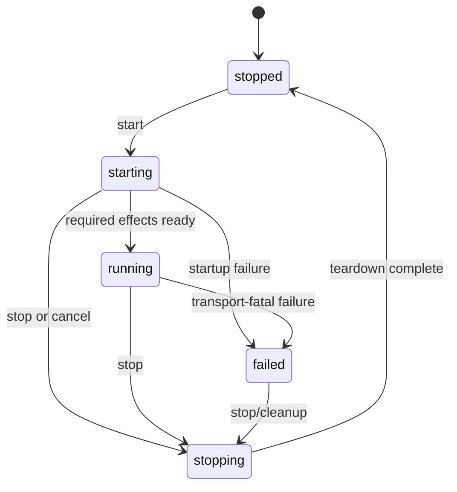
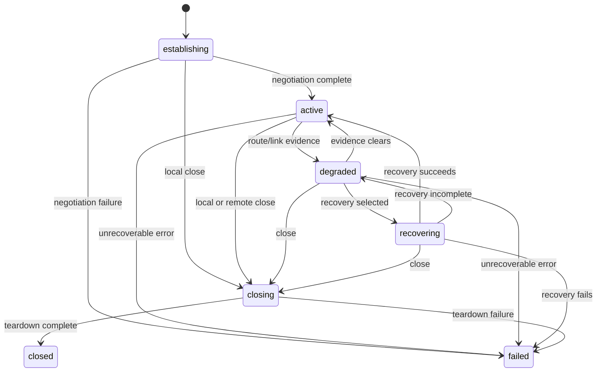
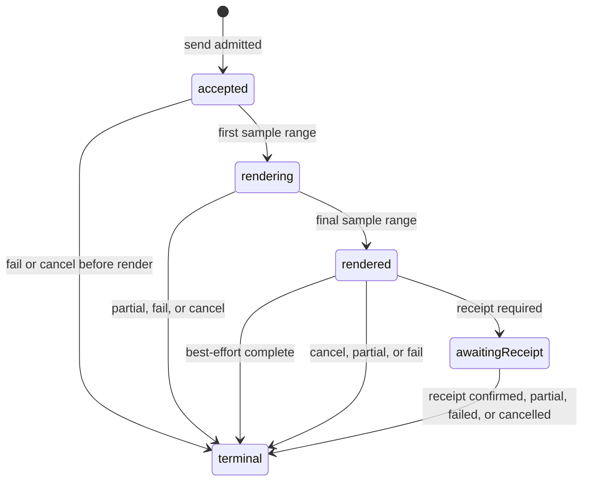
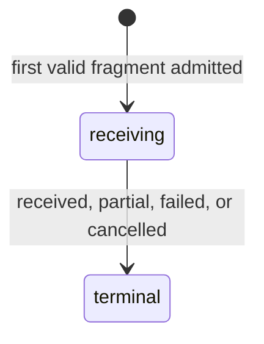
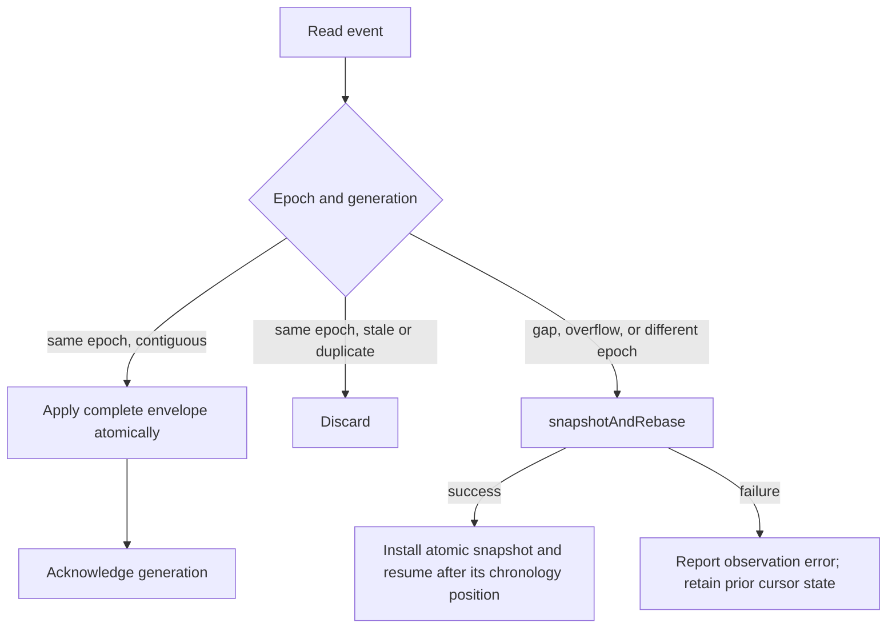

# Cyrinx 3.0 semantic contract

Status: accepted architecture contract for C3-01. This document specifies
observable semantics and ownership. It does not add the production declarations
or reducer implementation owned by later plan items.

The terms **must**, **must not**, **required**, and **prohibited** are normative.
Implementation examples are informative.

## 1. Canonical state domains and owners

Every mutable state domain has one authority. A binding may cache or present a
projection, but it may not independently transition canonical state.

| State domain | Canonical owner | Mutation context | Non-owning projections |
|---|---|---|---|
| Transport lifecycle and epoch | C session reducer | Session reducer executor | Swift actor, Kotlin scope, application snapshots |
| Discovery schedule, observations, and role election | C session reducer | Session reducer executor | `CyrinxPeer` values |
| Connection lifecycle and negotiated capabilities | C session reducer | Session reducer executor | `CyrinxConnection` snapshots |
| Transfer lifecycle, terminal outcome, and receipt evidence | C session reducer | Session reducer executor | `CyrinxTransfer` snapshots and waiters |
| Inbound mailbox payload, capacity, availability, and claim state | C session reducer | Session reducer executor | Snapshot metadata and atomic facade claim results |
| Profile/policy identity and geometry | C registry | Registry generation/build step | Generated binding values (immutable, presented not mutated) |
| Wire/profile/policy selection (active runtime choice) | C session reducer | Session reducer executor | Generated binding values and the registry-sourced candidate set |
| Link measurements and validity interval | C DSP result committed by reducer | DSP workspace, then reducer commit | `LinkEstimate` values |
| Event epoch, generation, order, cursor lease/ack/rebase, and overflow marker | C session reducer | Session reducer executor | Facade delivery queues |
| Security status and negotiation failure | C session reducer | Session reducer executor | Transport/connection snapshots |
| Timer intent and interpretation | C session reducer | Reducer request and reducer result | Platform timer object |
| Audio route/device state | Platform audio adapter | Adapter/device executor | Route effects submitted to reducer |
| PCM queue indices and discontinuity markers | Platform audio adapter queue endpoints | Audio callback plus declared consumer/producer | Reducer diagnostics |
| Swift handles, subscribers, and continuations | Swift facade actor | Actor executor | Application references |
| Kotlin handles, flows, and continuations | Kotlin binding scope | Serialized coroutine context | Application references |
| Application payload after delivery and UI state | Application | Application-selected executor | None |

No row may acquire a second canonical owner in an implementation PR. A new
state domain must be added to this table or to a superseding ADR before code
depends on it.

## 2. Identity and lifetime

### 2.1 Transport

`CyrinxTransport` is the persistent root object for one local endpoint. It owns
at most one active run epoch. Starting atomically creates a new nonzero epoch
before effects are requested. Stopping closes admission immediately but retains
that epoch through the final teardown commit. Restarting the same facade
creates a different epoch.

The never-started baseline uses the reserved tuple `(epoch: 0, generation: 0)`.
Epoch zero is never attached to an effect, peer, connection, or transfer.
After a run stops, snapshots retain its last nonzero epoch and final generation
as an observation tombstone, while `hasActiveRun` is false. The next accepted
start replaces it with a fresh nonzero epoch. Thus lifecycle observation never
depends on an optional or missing ordering key.

Effects carry both the public run epoch and a reducer-issued effect token.
Entering `stopping` invalidates ordinary work tokens but leaves only the
explicit teardown tokens valid. The final transition to `stopped` invalidates
those tokens. A late or duplicated result can therefore be rejected without
erasing the epoch needed to order the teardown event.

The transport owns the live connection and transfer registries. A facade may
retain terminal snapshots after the C resources are released, subject to a
documented count or time bound.

### 2.2 Peer

`CyrinxPeer` is an immutable observation, not a live owner. Its opaque ID is
unique only within its transport epoch. It may contain capability and
observation evidence, but it is not:

- a hardware serial number;
- stable across transport restarts;
- proof that two observations represent the same physical device; or
- an authenticated identity.

A peer from an obsolete epoch cannot create a connection. The facade returns a
structured stale-peer/state error.

### 2.3 Connection

`CyrinxConnection` has a reducer-issued ID unique within the transport epoch.
It owns no independent protocol state in the binding. The handle references a
canonical connection snapshot.

Closing a connection rejects new outbound messages before acceptance. Existing
transfer outcomes remain queryable. A terminal connection handle does not keep
audio capture or unbounded diagnostics alive.

### 2.4 Transfer

`CyrinxTransfer` has a reducer-issued ID unique within the transport epoch and
an immutable direction. An outbound transfer comes into existence only when the
message has been accepted. An inbound transfer comes into existence when the
reducer admits the first valid fragment into bounded reassembly state.

The handle remains stable through terminal state. Transfer IDs are never reused
within an epoch. A terminal snapshot is immutable.

### 2.5 Value types

`CyrinxTransport.Configuration`, `LinkEstimate`, `SendOptions`,
`SecurityStatus`, snapshots, event payloads, receipts, partial evidence, and
structured errors are values. They do not borrow mutable C storage. A
`LinkEstimate` states its epoch, generation, measurement direction, monotonic
clock identity, sample/time interval, active profile, and which measurements
are valid; zero is not a substitute for “unknown.”

## 3. Transport lifecycle

The transport lifecycle is:

- `stopped`: no active run or audio/session resources; the observation tuple is
  either the never-started baseline or the tombstone of the last run;
- `starting`: the epoch exists and required effects are being established;
- `running`: commands, discovery, and connections may be admitted;
- `stopping`: new work is rejected and current-epoch effects are being
  invalidated and released; and
- `failed(error)`: the epoch encountered a transport-fatal error and admits no
  new work.

The async `start` operation returns only after the transport reaches `running`.
It throws the structured startup failure if `starting` reaches `failed`.
Cancellation before reducer admission creates no epoch. An owning-call
cancellation that commits after admission but before running-ready orders a
stop; `start` then throws cancellation only after that stop has reached
`stopped`, so no hidden starting transport outlives the operation. If
running-ready commits first, the successful start is already terminal and any
subsequent cancellation cleanup is ordered as a separate stop.

The reducer linearizes concurrent lifecycle commands. The first admitted
`start` in `stopped` owns the startup intent and creates the epoch. Other
callers observe these fixed outcomes:

| Observed state or race | Result |
|---|---|
| `start` in `starting` | Join the existing startup result. Cancellation of a joining caller detaches only that waiter and does not stop the shared startup. |
| `start` in `running` | Return idempotent success for the current epoch. |
| `start` in `stopping` | Reject with a retryable lifecycle error; it is not queued for the next epoch. |
| `start` in `failed(error)` | Return the retained failure until cleanup reaches `stopped`. |
| Owning `start` cancellation after admission | Order stop. Cancellation wins only if its command commits before running-ready; cleanup reaches `stopped` before the caller resumes. If running-ready committed first, startup success remains committed and cancellation is handled as a subsequent stop request. |
| A separate `stop` racing startup | If stop commits first, startup ends with a structured `startupInterrupted` result after teardown. If running-ready commits first, `start` succeeds and stop then proceeds from `running`. |
| Startup failure racing stop or owning cancellation | The first terminal cause committed by the reducer is retained. Later effect results and competing causes are stale; callers join the resulting failure or teardown completion without replacing its cause. |

The async `stop` operation closes admission when accepted and returns only
after `stopped`. A teardown error is retained in the final snapshot and may be
thrown to the caller, but it does not leave the logical endpoint accepting
effects. Calling `stop` in `stopped` is an idempotent no-op. Calling it in
`stopping` joins the existing stop operation. Caller-task cancellation after
stop admission cannot reverse teardown; the operation finishes cleanup before
resuming the caller with cancellation or the more specific teardown error.

Invalid lifecycle transitions include:

- `stopped` directly to `running`;
- `running` directly to `stopped`;
- `failed` directly to `starting`; cleanup must finish first;
- any state transition caused by an effect from an obsolete epoch; and
- admission of a connection or transfer outside `running`.

When stop is accepted or a transport-fatal failure occurs, all connections
immediately reject new messages. Stop uses immediate connection closure:
accepted transfers receive ordered cancellation after any already committed
positive terminal outcome. Connections then become terminal: normally
`closed`, while an already-failed connection or a teardown failure remains
`failed`. Only after every connection and transfer is terminal does the
transport commit `stopped`. A transport-fatal failure instead first commits
every affected connection to `failed(transportFatal)`, then terminates that
connection's nonterminal transfers with `partial` when positive partial
evidence exists and `failed(transportFatal)` otherwise — the same
connection-before-transfers order as the `failed(connectionFailure)` cascade,
and a distinct reason tag so bindings can distinguish one dead connection
from a transport-wide fatality. Obsolete effects cannot complete a transfer
after this cascade.

## 4. Discovery and peer observations

Discovery activity is owned by the transport reducer and is meaningful only
while the transport is `running`. The reducer may enable, pause, or schedule
discovery around half-duplex transfers. These scheduling choices do not create
a second application-visible lifecycle state.

Peer observations form an epoch-scoped set with per-observation generation and
expiry. Reobserving the same opaque peer ID updates its immutable snapshot and
advances the transport generation. Expiry removes the observation but does not
implicitly close an already established connection; the connection reducer
uses its own liveness evidence.

Role election is internal connection-establishment state. A 2.x explicit role
value is a migration input only and cannot override a contradictory negotiated
result in the canonical 3.0 path.

## 5. Connection lifecycle

A connection is:

- `establishing`: validating the peer epoch, electing roles, and negotiating
  compatible capabilities;
- `active`: can accept messages allowed by the negotiated bounds;
- `degraded(evidence)`: remains usable under an explicitly reduced or uncertain
  link condition;
- `recovering(evidence)`: performing a bounded recovery action and rejecting
  new messages with a retryable state error;
- `closing(mode)`: rejects new messages and applies the selected close rule to
  existing work;
- `closed`: terminal orderly closure; or
- `failed(error)`: terminal connection-specific failure.

`closed` and `failed` are terminal. A new association to the same peer
observation receives a new connection ID.

Message admission and closure are fixed as follows:

| State or command | New message admission | Already accepted transfers |
|---|---|---|
| `establishing` | Reject as not ready | None |
| `active` | Admit within negotiated bounds | Continue |
| `degraded` | Admit within the currently reduced negotiated bounds | Continue |
| `recovering` | Reject with retryable recovering-state error | Continue or reach an evidence-based terminal outcome under their existing deadlines |
| Graceful close with a required monotonic deadline | Reject immediately | Drain until terminal; at the deadline, remaining transfers terminate as `partial` when evidence exists and `cancelled(connectionCloseDeadline)` otherwise |
| Immediate close | Reject immediately | Order cancellation; a positive outcome already committed before cancellation wins |
| Orderly remote close | Reject immediately | Terminate nonterminal transfers as `partial` when evidence exists and `failed(remoteClosed)` otherwise, then enter `closed` |
| `closing` | Reject | Apply the already selected local or remote close rule |
| `closed` | Reject | Every admitted transfer is already terminal |
| `failed` | Reject | Before the failure commit, terminate every nonterminal transfer as `partial` when evidence exists and `failed(connectionFailure)` otherwise |

The public local close operation must select `graceful(deadline:)` or
`immediate`; there is no semantically ambiguous “drain or terminate” default.
A protocol-valid remote close selects the orderly-remote rule in the table.
Connection close returns only after `closed` or throws the connection failure.
Transport stop always selects immediate close as defined in Section 3.
Caller-task cancellation before close admission creates no close command.
Cancellation after admission cannot change the selected close mode or reopen
message admission. The reducer completes that close to `closed` or `failed`
before resuming the caller with cancellation or the more specific connection
failure.

Invalid connection transitions include:

- construction directly in `active`;
- `closed` or `failed` to any nonterminal state;
- `establishing` directly to `degraded` without an activated profile;
- a profile or role change that is not committed by the reducer;
- an `active` snapshot whose transport epoch is no longer current; and
- accepting a message in `establishing`, `recovering`, `closing`, `closed`, or
  `failed`.

## 6. Transfer lifecycle and evidence

### 6.1 Common rules

A transfer has one direction and one terminal outcome. There is no generic
`succeeded` state. Each positive outcome names the evidence actually observed.

Progress is monotonic in canonical payload bytes and scheduled/rendered sample
ranges. Retries may increase airtime without reducing canonical progress.
Progress may be unknown when a profile cannot provide a meaningful fraction;
the binding does not invent a percentage.

Terminal outcomes are:

- `bestEffortComplete(renderEvidence)`: every planned local sample was handed
  to the sink; no remote receipt is claimed;
- `receiptConfirmed(receiptEvidence)`: outbound only; a protocol receipt tied
  to this epoch/transfer reports that a protocol endpoint admitted the complete
  message to its bounded inbound mailbox;
- `received(receiveEvidence)`: inbound only; a complete CRC-valid message was
  admitted to the local bounded inbound mailbox;
- `partial(partialEvidence)`: valid fragments, samples, or receipts exist but
  the complete delivery contract was not met;
- `failed(error)`: no positive or partial terminal claim is appropriate; and
- `cancelled(stage)`: ordered cancellation became effective before another
  terminal outcome.

`partial` is not emitted on the ordinary completed-message stream. An
application must opt into diagnostic partial evidence. Partial payload bytes
are never passed off as a complete message.

### 6.2 Outbound transfer

Outbound states are:

- `accepted`: bounded queue ownership and transfer ID assigned;
- `rendering`: at least one sample range has been scheduled or handed to the
  audio sink;
- `rendered`: the complete planned local sample range was handed to the sink;
- `awaitingReceipt`: local rendering completed for a receipt-requiring mode;
  and
- `terminal(outcome)`.

The `rendered` transition is observable even when the next reducer turn commits
`bestEffortComplete`. It never means the remote microphone captured or decoded
the signal.

For receipt-requiring delivery, timeout after complete local rendering is
`failed(timeout)` unless selective receipt evidence proves a meaningful
partial result. A route interruption after only part of the waveform is
`partial` when the implementation can report the exact rendered range;
otherwise it is `failed(routeChanged)`.

Cancellation or failure after `rendered` but before the next terminal commit
is ordered normally. In best-effort mode, a cancellation command that reaches
the reducer before `bestEffortComplete` produces `cancelled(afterRender)`;
`rendered` remains evidence but is not itself a terminal success. A route or
sink failure in that window produces `partial` only with precise positive
evidence and `failed` otherwise. Once any terminal outcome commits, later
cancellation is an idempotent no-op.

Invalid outbound transitions include:

- `accepted` directly to `rendered`;
- `accepted` or `rendering` directly to `receiptConfirmed`;
- `rendered` directly to `receiptConfirmed` when a receipt was required;
- entry to `awaitingReceipt` for best-effort mode;
- outbound `received` or inbound `receiptConfirmed`;
- progress or state mutation after a terminal outcome; and
- changing delivery mode after acceptance.

### 6.3 Inbound transfer

Inbound states are:

- `receiving`: the first valid fragment was admitted to bounded reassembly; and
- `terminal(outcome)`.

The reducer commits `received` only after the complete immutable payload has
been inserted into the bounded inbound mailbox. Only then may it emit a
positive protocol receipt. Duplicate acoustic frames may update diagnostics
but cannot insert or deliver the message again. After a duplicate valid data
frame for an already received transfer, the endpoint may retransmit the same
idempotent final receipt so a lost receipt can recover; this does not create a
new mailbox entry, event, transfer outcome, or receipt claim.

The mailbox entry remains authoritative until one facade claim operation
atomically transfers the payload to the application. Event loss, subscriber
overflow, and snapshot refresh cannot delete it. Successful claim removes it,
and subsequent claims fail as already consumed. If the mailbox is full, the
message does not become `received` and no positive receipt is emitted; bounded
retry or a resource-exhausted terminal outcome follows negotiated policy.
Stopping may discard unclaimed in-memory entries after ordered transfer
cancellation, so `receiptConfirmed` is endpoint admission rather than durable
application storage.

Invalid inbound transitions include `rendering`, `rendered`, or
`awaitingReceipt`, `received` before complete integrity validation and mailbox
admission, and any
nonterminal transition after reassembly storage has been released.

### 6.4 Receipt claim boundary

A receipt establishes only that a protocol-valid response associated with the
current epoch and transfer was decoded. Its CRC is accidental-corruption
detection, not cryptographic integrity. Cyrinx 3.0 is unauthenticated. The
receipt does not establish legal identity, device ownership, confidentiality,
distance, resistance to relay or replay, or user intent.

## 7. Event generations and snapshot recovery

### 7.1 Epoch and generation

The C reducer owns:

- a nonzero transport `epoch` that changes for every accepted start, with
  `(0, 0)` reserved for the never-started snapshot;
- an unsigned 64-bit `generation`, whose first externally visible commit in a
  new nonzero epoch is one; and
- the total order of externally visible state changes within the epoch.

Each externally visible reducer commit increments the generation exactly once.
The one composite event envelope and the atomic snapshot produced after that
commit carry the same epoch and generation. Multiple state fields or handles
changed by one reducer turn are collected into that envelope; a reducer never
emits two independent envelopes with the same generation.

Generation never wraps within an epoch. The final three values are a shutdown
reserve: no ordinary commit advances beyond `UInt64.max - 3`. When another
ordinary commit would be required there, the reducer instead commits one
composite generation-exhausted failure cascade at `max - 2`, `stopping` at
`max - 1`, and `stopped` at `max`. A later accepted start creates a fresh epoch
at generation one. An implementation must not silently wrap or reset a
generation within an epoch.

### 7.2 Event envelope

Every composite event contains at least:

- epoch;
- generation;
- an ordered nonempty list of typed changes and their affected stable handle
  IDs;
- the immutable deltas needed by the facade to apply the commit atomically; and
- an indication that one or more earlier events were dropped, when known.

Adjacent nonterminal commits may be coalesced only by replacing them with a
single overflow/gap indication; their generation numbers are never reused.
Terminal outcomes themselves cannot be rewritten, although a bounded delivery
queue may lose their event and require snapshot recovery. Completed inbound
payloads remain independently recoverable from the mailbox.

### 7.3 Atomic snapshot

A snapshot is read as one reducer turn and contains:

- epoch and generation;
- transport state;
- current peer observations;
- all live connection states;
- all live and retained transfer states/outcomes required by every valid core
  observation cursor;
- ordered identifiers and availability metadata for every unclaimed inbound
  mailbox entry;
- active profile/policy and version-axis values;
- link estimates and validity markers; and
- event/diagnostic drop counters relevant to recovery.

The snapshot's contents and generation are atomic relative to reducer commits.
A binding must not read a generation and state through separate unsynchronized
C calls.

### 7.4 Consumer algorithm

A facade maintains its last applied `(epoch, generation)`. The C observation
boundary exposes one atomic `subscribeWithSnapshot` operation (the eventual
name may differ) that registers the sole facade drain, captures an authoritative
snapshot, and returns a cursor positioned immediately after that snapshot.
The advertised cursor-count bound is exactly one live cursor per transport
context. A `subscribeWithSnapshot` call that would exceed that bound fails
with `resourceExhausted` and leaves the existing cursor — including its lease
and generation state — unchanged; it never silently evicts a live cursor.
Replacing the drain requires the current cursor to be released (or its lease
to expire) first, then a fresh `subscribeWithSnapshot`.
The bounded core event queue retains a sticky overflow marker for each cursor.
Applying a normal event is followed by a monotonic
`acknowledge(cursor, generation)` only after the facade has installed that
complete generation.

Gap recovery uses an atomic `snapshotAndRebase(cursor)` operation. On success,
it returns snapshot generation `G`, positions the cursor at the next reducer
chronology position strictly after `(epoch, G)`,
acknowledges through `G`, and clears that cursor's sticky overflow marker as one
all-or-nothing reducer turn. On failure it changes none of those values. The
facade installs the returned snapshot in a non-suspending critical section
before reading the rebased cursor; it cannot discard a successful rebase and
continue from that cursor.

The cursor is an opaque reducer watermark, not a generation integer. It can
represent the end-of-epoch position after generation `UInt64.max` without
performing overflowing arithmetic.

1. Atomically register and obtain the baseline snapshot plus cursor; install
   the snapshot before consuming from that cursor.
2. If an event epoch differs from the current epoch, discard cached state and
   call `snapshotAndRebase`.
3. If `lastGeneration < UInt64.max` and
   `event.generation == lastGeneration + 1`, apply the complete change list
   atomically and acknowledge that generation.
4. If `event.generation <= lastGeneration`, discard it as duplicate or stale.
5. If no same-epoch numeric successor exists, a higher generation is observed
   without contiguity, or the event reports overflow, stop applying deltas and
   call `snapshotAndRebase`. At `UInt64.max`, only an epoch change and rebase can
   advance observation.
6. After installing snapshot generation `G`, discard queued events from that
   epoch with generation `<= G`; resume only at the next reducer chronology
   position after `(epoch, G)`.

It is invalid to apply only part of a composite envelope, apply a stale or
duplicate generation as new state, cross an epoch boundary using deltas, skip a
generation without rebasing, clear sticky overflow outside a successful atomic
rebase, acknowledge before installing the full generation, or continue from a
cursor after failed rebase or lease invalidation.

Registration and snapshot capture are one reducer turn, so a commit cannot
fall between them. If snapshot retrieval fails, the facade reports a
structured observation error and retries according to its bounded policy. It
does not continue publishing a cache as current.

Terminal tombstones remain retained until every core observation cursor that
existed at their commit has acknowledged that generation. Cursor count and
lease duration are bounded and advertised. Before a lagging/abandoned cursor's
lease permits tombstone eviction, the reducer invalidates that cursor and
records an explicit `observationLost` condition. A later subscription receives
the current snapshot but cannot claim that evicted history was recovered.
Thus event loss is recoverable for a valid cursor without pretending that
queues, history, or abandoned observers are unbounded.

## 8. Commands, bounds, and ownership transfer

Every command declares the point at which input ownership changes.

- Before acceptance, validation failure leaves ownership with the caller and
  creates no transfer.
- At outbound acceptance, Cyrinx owns a bounded immutable payload copy or an
  explicitly documented transferred buffer.
- At inbound delivery, the application receives an immutable value independent
  of reassembly storage.
- Cancellation does not allow the caller to mutate memory still borrowed by an
  accepted command.

For outbound `send`, reducer admission is the cancellation linearization point:

- cancellation ordered before admission returns cancellation and creates no
  transfer;
- admission ordered first creates the transfer and must return its handle even
  if the caller task is then cancelled; and
- that later task cancellation is submitted as a separate transfer-cancel
  command and competes with render/receipt commits in reducer order.

Bindings may not check task cancellation after admission and throw away the
handle. Swift and Kotlin must expose the same ordering.

The implementation exposes effective message, queue, reassembly, retry, event,
PCM, and diagnostic bounds. Exact numbers may depend on the platform or
negotiated profile, but the full/empty behavior is fixed by
[ADR 0002](adr/0002-executor-and-thread-ownership.md).

### 8.1 Send options

`SendOptions` has these semantic fields:

| Field | Frozen behavior |
|---|---|
| Delivery mode | `bestEffort` completes on local sink submission and requests no endpoint receipt; `receiptRequired` completes positively only as `receiptConfirmed` |
| Priority | One of `low`, `normal`, `high`, or `critical`; FIFO is preserved within a class, a waveform already rendering is not preempted, and bounded anti-starvation behavior is identified by policy version |
| Deadline | Optional absolute instant from the injected monotonic transport clock; wall-clock time and clock changes are irrelevant |
| Profile policy | `negotiated` permits any negotiated profile, `require(id, hash)` permits exactly one profile, and `allow(set)` constrains selection to the set; no selection may silently escape the constraint |

The default options are `receiptRequired`, `normal`, no application deadline,
and `negotiated`. “No application deadline” does not remove the active policy's
finite retry/lifetime bound.

An expired deadline before admission creates no transfer. After admission,
deadline expiry orders a terminal deadline result: `partial` when exact
positive evidence exists and `failed(deadlineExceeded)` otherwise. It is not
reported as caller cancellation. Receipt-required retries and graceful close
cannot extend the deadline. An absent application deadline still uses the
advertised finite retry/lifetime bound from the active policy.

Priority changes scheduling order only. It does not strengthen reliability,
security, deadline, or receipt evidence. The exact cross-class fairness
quantum may evolve only with an observable policy-version change.

Profile compatibility and selection scoring are owned by C3-04 and C3-23.
Those implementations may refine registry content and policy, but cannot add
silent fallback outside the three constraints above.

## 9. Structured error contract

`CyrinxError` contains a stable machine-readable category and context. The
concrete Swift/Kotlin representation is owned by C3-24/C3-25, but it must
preserve these semantic fields:

| Field | Requirement |
|---|---|
| Category/code | Stable value suitable for programmatic matching |
| Operation | The public command or observation that failed |
| Stage | Pre-acceptance, setup, render, receipt, receive/reassembly, recovery, or teardown |
| Retryability | Whether retry is safe on the same connection, needs a new connection, or is not advised |
| Epoch and handle IDs | Included when the failure belongs to admitted state |
| Underlying evidence | Optional C status, OS error, profile/wire value, or bounded diagnostic reference |
| Description | Human-readable diagnostic text; not a stable matching key |

Required categories include:

- invalid argument;
- lifecycle or connection state;
- queue full or resource exhausted;
- observation cursor invalidated or history lost;
- unsupported capability or delivery mode;
- cancelled;
- deadline or timeout;
- audio route changed or unavailable;
- profile or version mismatch;
- protocol violation;
- data-integrity failure; and
- internal failure.

An unknown lower-layer error maps to `internal` with retained underlying
evidence. It does not collapse a known queue, timeout, route, profile, or
integrity condition into a generic string.

## 10. Security status and downgrade behavior

Every transport and connection snapshot carries `SecurityStatus` with separate
authentication, confidentiality, and peer-identity claims. Cyrinx 3.0 accepts
only the baseline value:

- authentication: none;
- confidentiality: none;
- peer identity: unauthenticated;
- mechanism identifier and trusted key identifier: absent.

The status is explicit so an application cannot infer security from a CRC,
protocol receipt, acoustic/device fingerprint, route, or opaque peer ID.
Legacy `device_signature`, public-key, and security-mode fields are migration
data only and do not raise this status.

No 3.0 `SendOptions` field requests a stronger mode. If local configuration or
a peer requires an unknown or nonzero security mechanism, connection
establishment fails with `unsupportedCapability` or `profileMismatch` before
message admission. A previously observed stronger/unknown offer disappearing
is an observable negotiation delta with a named mechanism, not an aspiration:
the peer observation carries the peer's last observed security capability, a
change to it is a typed change in the composite event envelope (§7.2) with its
own generation like every other observable delta, and a downgrade detected
during establishment fails the connection with `unsupportedCapability` before
message admission — so an active unsecured connection can never appear as the
silent result of an offer disappearing. Positive security claims require a
superseding contract, the separate cryptographic program, and external review.

Specifically, legacy `Config.enableCrypto == true`, a nonzero legacy security
mode, or supplied legacy local key material is an explicit unsupported
security request and fails before connection establishment. It is never
ignored as though unsecured operation had been requested. A legacy device
signature may remain bounded diagnostic evidence but cannot raise identity
status.

## 11. Migration invariants

Until C3-35:

- every existing 2.x public declaration remains classified in
  [`api-inventory.json`](api-inventory.json);
- a shim cannot claim stronger delivery than the canonical transfer outcome;
- old stream, gear, event, metrics, and configuration types do not become a
  second owner of state;
- migration calls that cannot represent a 3.0 result fail explicitly rather
  than silently downgrade it; and
- the Swift and C inventory checker fails for any new, changed, removed,
  duplicate, wildcard, or unclassified source-declared public symbol.

A 2.x compatibility declaration and every 2.x input/result type in its
signature remain usable as one source-compatible closure even when their
inventory dispositions differ. For example, a deprecated `CyrinxSession`
method may continue to expose a `replace`-classified `ReceivedMessage`; both
spellings remain present while the preferred 3.0 path is
`CyrinxTransfer`. `replace` changes canonical direction, not the C3-35
availability promise.

Retained Swift calibration and noise-scanner spellings are facades, not second
DSP or policy authorities. Their 3.0 implementation must delegate measurement,
mask geometry, and gain/profile policy to the canonical C contracts while
platform adapters retain only device-volume effects. The 2.x in-memory
transport case and its legacy implementation remain quarantined in the
compatibility umbrella through C3-35. Its canonical replacement is
`CyrinxSimulation`; the new production core cannot select it as a backend.

After the 3.0 release, removing a retained migration shim requires a later
semantic major version even when its implementation has already delegated to
the 3.0 core.

## 12. Conformance tests owned by later PRs

This contract defines the fixtures later work must add:

- table-driven valid and invalid lifecycle transitions;
- connection terminal-state immutability;
- outbound and inbound transfer transition matrices;
- distinction between accepted, rendered, best-effort complete,
  receipt-confirmed, and received;
- partial evidence never emitted as a complete message;
- event duplicate, stale, gap, overflow, epoch-change, and snapshot-race cases;
- never-started, stop, fatal cascade, and restart epoch traces;
- concurrent start/join/idempotence, stop-versus-ready, retained startup
  failure, and start cancellation before and after reducer admission;
- send cancellation before and after transfer admission;
- one-generation commits that change multiple handles;
- cursor acknowledgement, failed rebase, successful rebase, and sticky-overflow
  clearing;
- inbound mailbox recovery after facade event overflow;
- recovering-state rejection and graceful/immediate close matrices;
- connection-close cancellation before and after reducer admission;
- best-effort cancellation and failure in the observable rendered window;
- delivery-mode, deadline-clock, priority, and profile-constraint behavior;
- unsecured status and explicit unsupported-security rejection;
- effect completion after cancellation or epoch invalidation;
- command and message queue rejection before transfer creation;
- callback ingress overflow and egress underrun discontinuity behavior;
- C, Swift, and Kotlin traces with identical generations and terminal outcomes;
  and
- error category/stage/retryability parity across bindings.

New deterministic Swift tests use Swift Testing under C3-02. Existing XCTest
tests stay in place until a mechanical migration is independently reviewed.
UI automation and performance measurement remain XCTest responsibilities.
