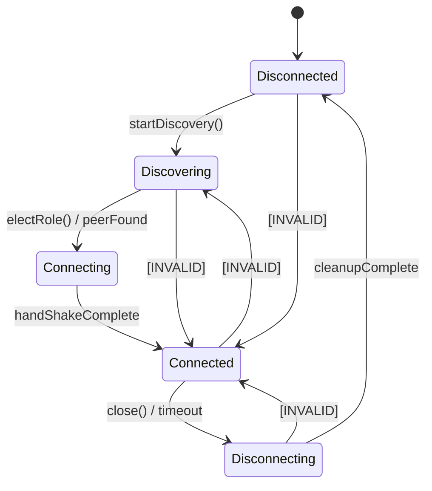
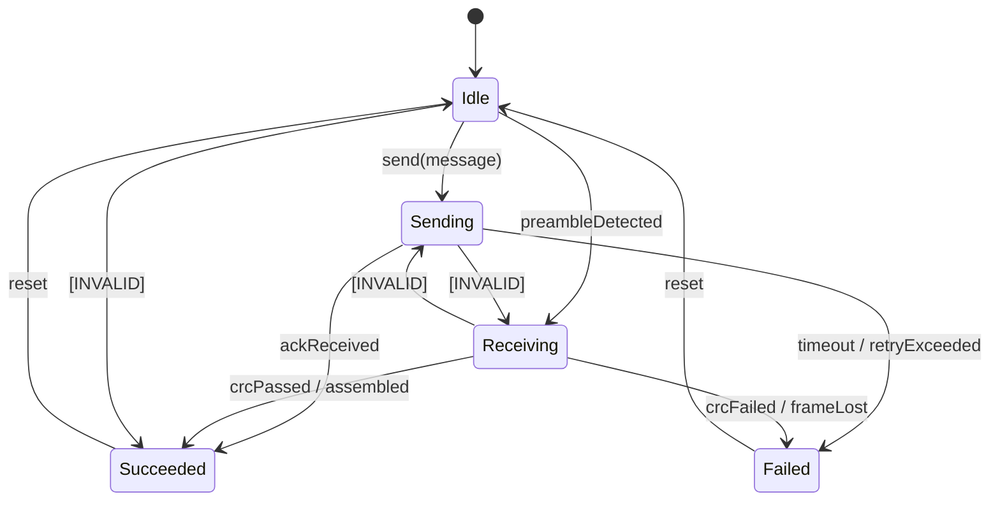

# ADR 0001: Canonical C Core Ownership

## Status
Accepted

## Context
In Cyrinx 2.x, the boundary between the portable C implementation and the platform-specific wrappers (Swift and Kotlin) was sometimes ambiguous. Portions of the physical layer (PHY) and scheduling configurations were replicated or recalculated across language boundaries, leading to drift, alignment bugs, and increased test surface. As we move to Cyrinx 3.0, we must establish a single source of truth for all modem state, packet framing, diversity logic, and session control.

## Decision
All critical modem logic, state machines, protocol timers, and mathematical processing are canonicalized within the portable C core (`Sources/CCyrinx`). The Swift (`Cyrinx`) and Kotlin bindings are thin facades.

### Canonical Responsibilities (C Core)
- **Modem State**: All active session variables, roll-off state, session-timer tracking, and backoff counters.
- **Physical Layer (PHY)**: Bootstrap and bulk PHY modulation/demodulation, pilot residual analysis, channel estimation, and Maximum Ratio Combining (MRC) diversity decisions.
- **Framing & Codecs**: FEC encoding/decoding, interleaving, puncturing, cyclic redundancy checks (CRC-32/CRC-16), packet encapsulation, and fragmentation/reassembly.
- **Metrics**: Real-time signal-to-noise ratio (SNR), error vector magnitude (EVM), and channel reliability calculations.

### Binding Responsibilities (facades)
- **Platform I/O**: Direct interaction with platform audio APIs (e.g., iOS CoreAudio/AVAudioEngine, Android AudioRecord/AudioTrack).
- **Concurrency & Scheduling**: Dispatches core operations onto platform thread executors.
- **Serialization & FFI**: Marshaling structures across the Foreign Function Interface (FFI) boundary.
- **Lifecycle & Events**: Mapping core state snapshots into platform-native reactive events (e.g., Swift AsyncStream/Actor, Kotlin Flow).

---

## Independent Versioning Axes
To prevent coupled version lock, Cyrinx 3.0 separates its interfaces into distinct version axes:

1. **Semantic Version (e.g., `3.0.0`)**: The public surface version of the SDK, following semver rules.
2. **ABI Version (e.g., `3`)**: The C layout structure compatibility identifier. Increments only when struct sizes or layout offsets change incompatibly.
3. **Wire Version (e.g., `3`)**: The acoustic frame format identifier. Increments if the over-the-air preamble, pilot pattern, or header framing changes.
4. **Profile ID/Hash (e.g., `0x8FA4`)**: A unique 32-bit CRC or identifier of a modulation profile (constellation, carrier spacing, etc.).
5. **Policy Version (e.g., `1`)**: Rules governing link adaptation, backoff coefficients, and roll-off triggers.
6. **Schema Version (e.g., `1`)**: The structured format of exported diagnostics and session replays.

---

## State Transitions

### Session Connection Lifecycle

### Transfer State Lifecycle

---

## Snapshot Recovery after Event Loss
The C session reducer maintains a monotonic event generation number (`event_generation`). 
- When the facade processes events, it checks that the sequence of event generations is contiguous.
- If an event is lost or dropped across the FFI queue, the facade detects a gap in `event_generation`.
- **Recovery Protocol**: The facade must discard local state assumptions and query `cyrinx_session_get_snapshot()` to rebuild its connection/transfer state directly from the canonical C core.

---

## Migration Promise
All Cyrinx 2.x public entry points (e.g., `BulkPHY` and `CyrinxSession`) will remain in the codebase as deprecated shims. They will delegate internally to the 3.0 C engine. These shims will be kept until the final 3.0 migration PR, ensuring that clients can upgrade without breaking existing code.
