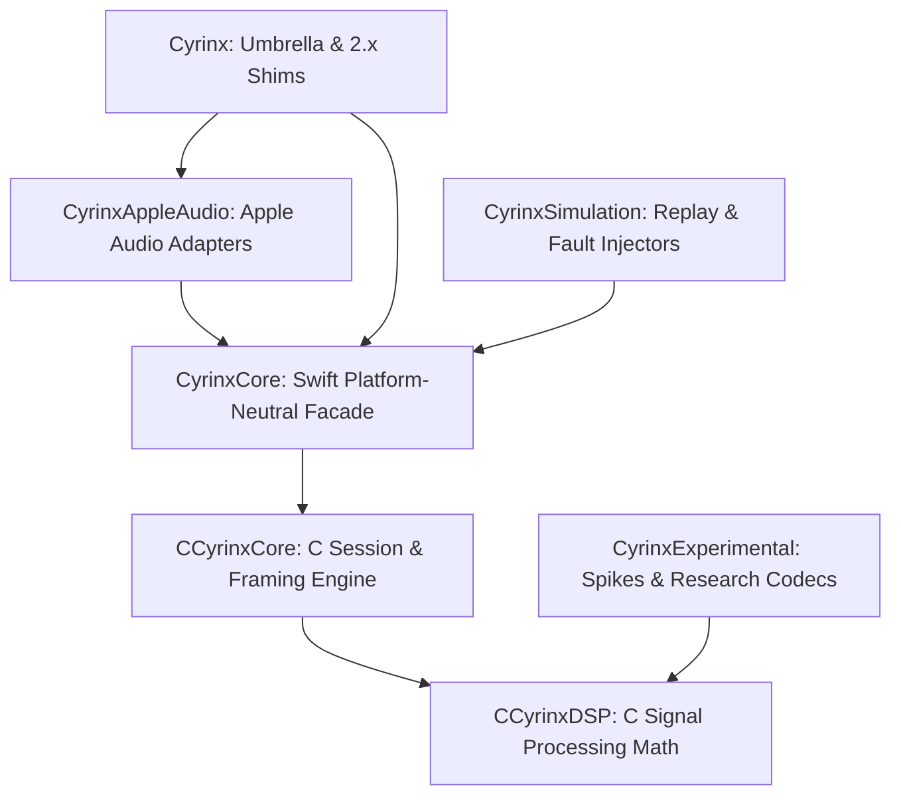

# ADR 0004: Module Boundaries

## Status
Accepted

## Context
As Cyrinx expands to support multiple platforms (iOS, macOS, Android) and multiple use cases (real-time stream transport, in-memory simulations, offline research), maintaining a clean separation of concerns is vital. The codebase must prevent circular dependencies, ensure that platform-specific frameworks (like Apple's AVFoundation) do not pollute the core signal-processing engine, and allow testing of the core state machine in isolation.

## Decision
We define seven modular boundaries, each with a strict responsibility scope and a clear dependency direction.

### Dependency Graph

---

### Module Definitions

#### 1. CCyrinxDSP (C Core)
- **Role**: Highly optimized, platform-independent C digital signal processing logic.
- **Contents**: FFT (KissFFT), OFDM/DCSS modulators, demodulators, channel estimators, MRC combiners, and pilot reliability metrics.
- **Constraints**: No file I/O, no network access, and no operating system-specific calls.

#### 2. CCyrinxCore (C Core)
- **Role**: Session state management, frame formatting, packet fragmentation/reassembly, and error recovery policies.
- **Contents**: Connection handshake sequences, profile registries, event queue management, sliding retry windows, and diagnostic schemas.
- **Constraints**: Depends only on `CCyrinxDSP`. Fully portable across POSIX, Apple, and Android environments.

#### 3. CyrinxCore (Swift Library)
- **Role**: Idiomatic Swift representation of the C core's interfaces, exposing a platform-neutral, thread-safe, message-first API.
- **Contents**: `Sendable` value types for profiles and metrics, Swift error mappings, event streaming interfaces, and the core `CyrinxTransport` actor facade.
- **Constraints**: Contains no audio-hardware routing or platform device-specific APIs (no AVFoundation, no CoreAudio).

#### 4. CyrinxAppleAudio (Swift Library)
- **Role**: Low-level audio capture and render engine scaffolding for Apple platforms.
- **Contents**: AVAudioEngine configurations, AURemoteIO wrapper callbacks, and Apple hardware routing/category observers.
- **Constraints**: Safe for real-time thread operation (conforming to ADR 0002).

#### 5. Cyrinx (Swift Library)
- **Role**: Umbrella module exposing the primary unified 3.0 Swift API, along with legacy 2.x compatibility shims.
- **Contents**: Module imports and public wrappers. This is the entry point imported by client applications.

#### 6. CyrinxSimulation (Swift / C Library)
- **Role**: Simulation, deterministic clock control, and fault injection for automated testing.
- **Contents**: Simulated channel models (multipath, attenuation, additive noise), replay loaders for captured PCM files, and hardware-in-the-loop (HIL) harnesses.

#### 7. CyrinxExperimental (Swift / C Library)
- **Role**: Sandbox for unverified features, new modulation spikes, and research codecs.
- **Contents**: Unqualified codecs (e.g., prototype raw tone codecs), experimental bit-loading research.
- **Constraints**: Code in this package is not covered by semver guarantees and is excluded from production builds.
